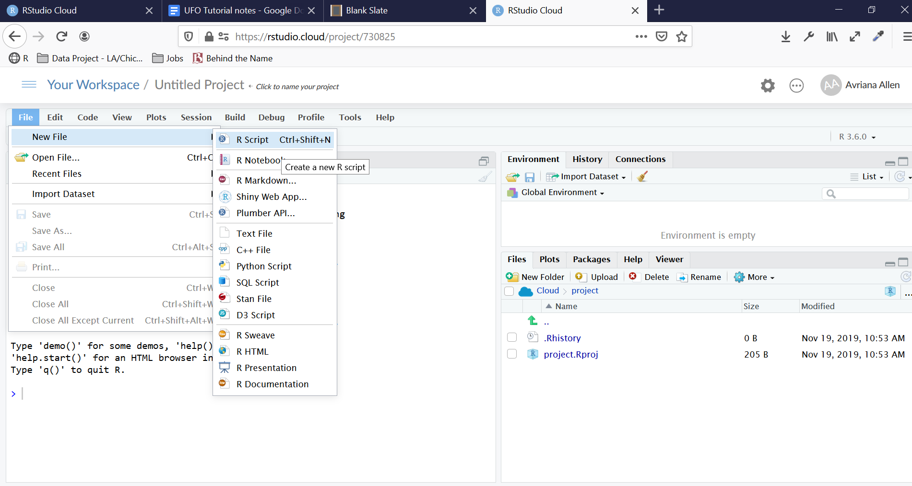
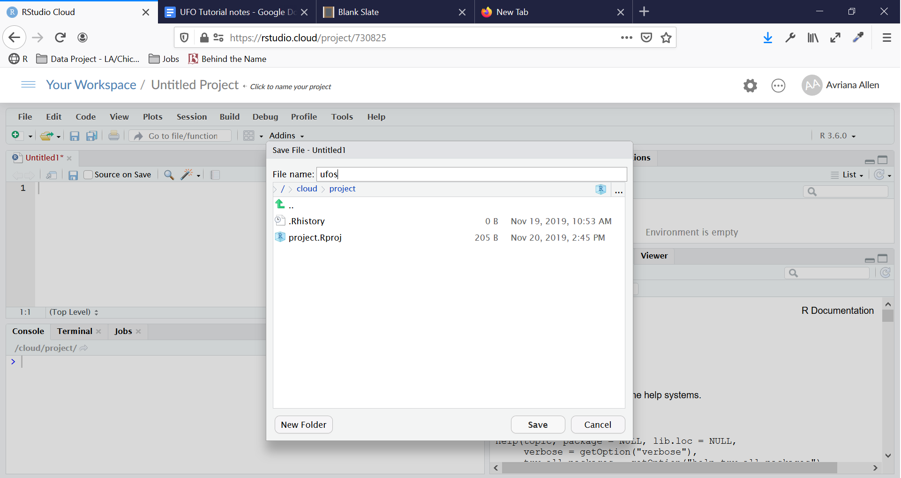
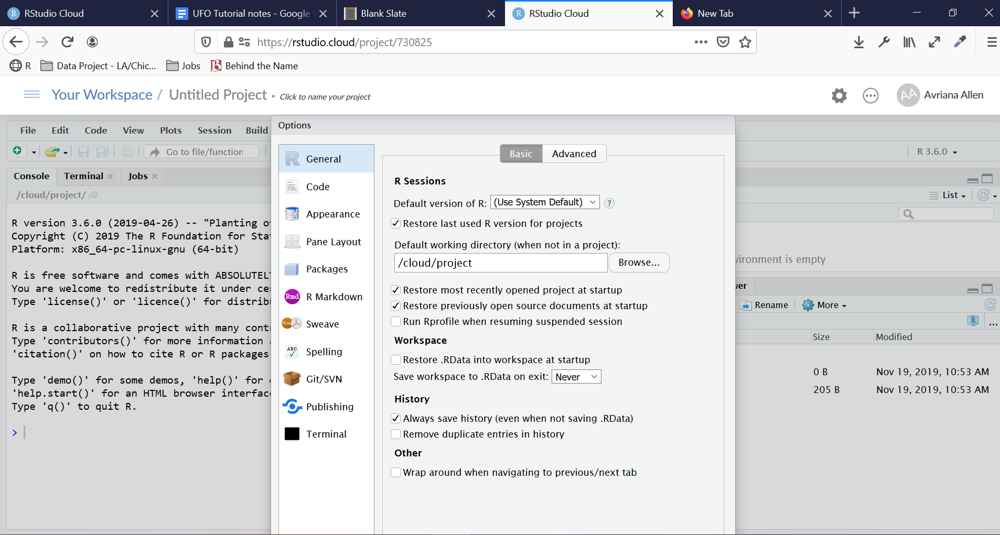
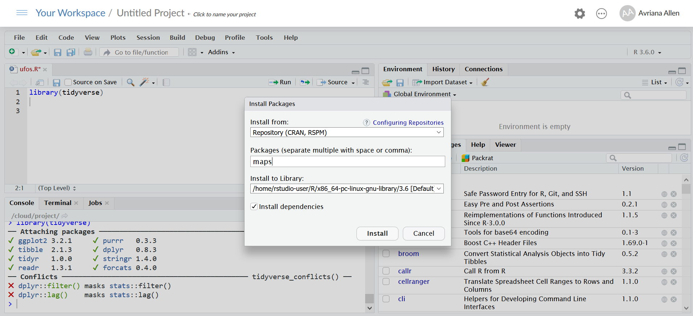
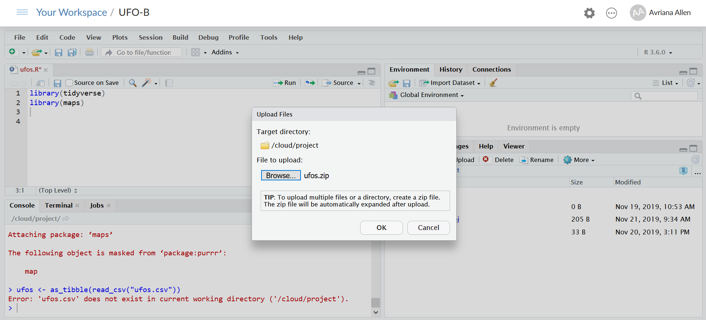
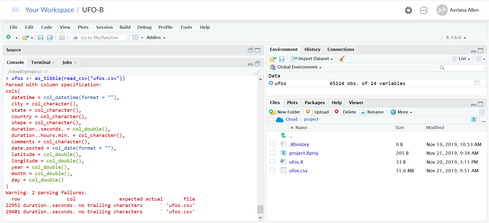

<head>

<link rel="stylesheet" href="https://cdn.knightlab.com/libs/orangeline/0.1.1/css/orangeline.min.css">

<style>

@import url('https://fonts.googleapis.com/css?family=Montserrat&display=swap');

body{
font-family: Montserrat;
}

pre:not(.r) .hljs{
color: #484848;
}

ol > li::marker{
font-size: 0em;
}

.title{
width:100%;
font-size: 3em !important;
text-align: center;
}
.author {
font-family: Montserrat;
text-align: right;
}

.date {
font-family: Montserrat;
text-align: right;
}

h1 > .intro{
color: #df4e13;
}

img{
display: inline-block;
padding: 15px 0px 15px 0px;
}

</style>

</head>


```{r setup, include=FALSE}
knitr::opts_chunk$set(echo = TRUE, message = FALSE, error = FALSE, warning = FALSE)
```

# <span class = "intro"> Welcome to R! </span>

## Purpose of this tutorial 

R is a great resource that has extremely good documentation, including several free books that systematically teach users the basics and then some. This tutorial is not meant to replace any such resources but to provide an initial project to try out **R** and **R Studio**. As such, it will present a streamlined process with jumping off points. If you are interested in learning more **R** there will be a recommended book list [at the end](#booklist). 

## R Studio Cloud

To complete this tutorial, you will need to create an account with [RStudio Cloud](https://rstudio.cloud/){target="_blank"} so navigate to [their homepage ](https://rstudio.cloud/){target="_blank"} and click *Get Started*.

Once you've made your account, you will be navigated to *Your Workspace*. Click the blue *New Project* button to the right of *Your Projects* and wait for the *Deploying Project* bubbles to disappear.

## R Script

Under *File* highlight *New File* and select *R Script*. 



Go ahead and save the file. This will be where we will be executing all our commands.



## Set up the environment

Open *Tools* and click on *Global Options*. There will be four sections, *R Sessions*, *Workspace*, *History* and *Other*. Under *Workspace*, uncheck 
 `Restore .RData into workspace at startup` and change `Save workspace to .RData on exit` to `never`. Hit *Ok* to save and exit. 
 


By changing these options, we are making it a little harder to pick up where you left off in a project after you close it, but this will make your code reproducible, allowing you to get the same results every time you run your code. 

## Run some code

Speaking of running code, R is a language that runs only selected code. What does that mean? It means that if your cursor is on a specific line, everything on that line is selected, and will be run. If you highlight some of your code, only what is highlighted is selected and will be run.

Try it out by typing `2 + 2` on the first line of your blank R script and `4 + 4` on the next one, Hit the *Run* button at the upper right corner of your R script and see what happens, (you can also use the keyboard shortcut *ctrl-enter*). 


<p class = "note"> All of the functions we will be using are well documented. If you ever have questions, run them in the console, (lower left pane) with a `?`in front, e.g. `?help()`</p>

# **R** and Data

## Load the Tidyverse 
<p class = "note"> This tutorial makes extensive use of the **Tidyverse**. </p>

If you have never used the **Tidyverse** before, you are about to meet one of the best packages in **R**. Or group of packages. The **Tidyverse** contains multiple packages designed to clean data, wrangle it and graph it. The packages are compatible with each other, so you can easily move through each stage of cleaning, plotting and presenting.

To install the **Tidyverse**, either click on the *Packages* tab in the lower right pane, then the *Install* button in the left corner. Type in `tidyverse` and click *Install*. It will take a moment to run and it will fill your console with red text. The installation will finish with <code>The downloaded source packages are in '/tmp/RtmpPmVnsD/downloaded_packages'</code>. Now we can load the package into R using `library()`. This code should go at the top of your R Script. 

```{r library.1, message=TRUE}
library(tidyverse)
```

Let's load one more package, `maps`, beginning with the installation. 



```{r library.2, message=TRUE}
library(maps)
```

<p class = "note"> We only need to install packages once, after that we can always load them for use using the `library()` call. </p>

## Loading data 

We will be working with a semi-cleaned version of a UFO data set from [Kaggle](https://www.kaggle.com/camnugent/ufo-sightings-around-the-world){target="_blank"}. The original data set can be found [here](https://github.com/planetsig/ufo-reports){target="_blank"}. We will be only looking at data for the US. You can get the zipped file here: [ufos.zip](https://dxre-v3.github.io/data/ufos/ufos.zip){target="_blank"}. **R Studio Cloud** only takes data in a zipped format, so we will upload the data set into our environment as a zip file.

Under the *Files* tab in the lower right pane, click on *Upload* button. Find
the zipped file called `ufos` on your computer and upload it. You should see `ufos.csv` appear in your files.



Let's read in the csv as a tibble, which is a slightly more flexible version of a data frame and store it as a variable which we will use to call it for the rest of the lab. 

```{r import-data}
ufos <- as_tibble(read_csv("ufos.csv"))
```

You will get a print out that looks similar to the one below. 



You can ignore it. 

You should see `ufos` show up as data set in your *Global Environment* on the upper right pane of your screen. If you click on it, you will open the data in a new tab.

## Look at our data

Let's take a quick look at our data.   

```{r view.1}
glimpse(ufos)
```

The `glimpse()` function gives us a compressed view of the data, but here's a few things we can gather from the print out. 

* We have 14 variables and 65,144 observations
* 7 variable names are related to time
* 5 variable names are related to place
* We have 2 variables in date format, 6 in character and 6 in numerical format. 

## Form some questions

Now that we've made some observations about our data, let's ask some questions: 

* Which state has the most sightings? 
* Have the number of sightings increased over time? 
* Which shapes are seen most commonly? 

<br>

# Plotting

## Plot 1: Which state has the most sightings?

Let's start with the data. We want to know which state has seen the most ufos, which means we want the total number of observations for each state.

To do this, we're going to use the count function. If we give it a column name, (a variable), and it will count the rows, (observations), according to each unique value in the column.

<p class = "note"> This works well with a discrete variable but would not work well with a [continuous variable](https://www.youtube.com/watch?v=_yAQb8gWBpU){target="_blank"}. </p>

```{r plot1.1}
ufos %>% 
  count(state)
```

<div class = "note"> Throughout this tutorial we will be using what is called a [pipe](https://uc-r.github.io/pipe#pipe--operator){target="_blank"} `%>%`. When R runs a line of code with a pipe at the end, it takes that information and passes it on to the next line, which is also run.  If we were to write the function above without pipes, it would look like this `count(x = ufos, vars = state)`.

However, R is a positional language  when it comes to functions, meaning we don't have to write out what each entry is in the count function, if we give it the correct pieces in order, i.e. `count(ufos, state)`.
</div>
<br>

Let's arrange the data so we can see which states have the most observations. We will use a pipe so we don't have to save our data in a variable. Since `arrange()` automatically sorts from least to greatest, we will use `desc()` to flip this.

```{r plot1.2}
ufos %>% 
  count(state) %>% 
  arrange(desc(n))
```


If we want to see all the data, we can always pipe the data into a `view()`, but let's go even farther. Let's make a graph. We are going to use **ggplot2**, the part of the **Tidyverse** designed for graphing. There are four things you need to know immediately to use **ggplot**. 

1. To create a graph, you will always need to call `ggplot()` and then the type of chart you want, a `geom`. `ggplot()` creates the base layer that you will add plots to; the `geoms` are the charts you will be adding. 
2. There are two parts to each `ggplot()` or `geom` function, the `aes()` or aesthetics and the function itself. The data set, and anything you don't want to vary will be written the function, while any variables you want to vary per observation will be in the `aes()`.
3. **ggplot** takes information in order, which means that if you write your data in the right order you won't have to write out the full equality (like we do below). 
4. We use `+` as instead of `%>%` between lines of **ggplot2**.

```{r plot1.3}
ufos %>%
  count(state) %>% 
  ggplot(mapping = aes(x = state, y = n)) +
  geom_bar(stat = "identity") 
```


<div class = "note">
* We can pipe our data right into the plot.
* `geom_bar()` requires `stat = 'identity'` to use `n` as the height of each bar. Use `?geom_bar()` to find out why.
</div>

It is pretty hard to read this chart, so let's filter our data to just look at which states had more than 1000 observations. We can just add the `filter()` between the `count()` and the plot. Let's also tack a `coord_flip()` on which renders x values along the y axis and y values along the x axis.
  
```{r plot1.4}
ufos %>% 
  count(state) %>% 
  filter(n >= 1000) %>% 
  ggplot(aes(state, n)) +
  geom_bar(stat = "identity") +
  coord_flip()
```

## Plot 2: How have sightings changed over time? 

California is by far winning for the amount of sightings, so let's see if there is a change over time. 

First, let's filter by state, and then count up the number of observations by year. We can pipe that data directly into a bar chart. 
```{r plot2.1}
ufos %>% 
  filter(state == "ca") %>% 
  count(year) %>% 
  ggplot(aes(year, n)) +
  geom_bar(stat = "identity") 
```


**Try making some of these other plots:** 

```{r plot2.2, echo=FALSE, out.width='50%', fig.show='hold'}
# IL
ufos %>% 
  filter(state == "il") %>% 
  count(year) %>% 
  ggplot(aes(year, n)) +
  geom_bar(stat = "identity") +
  labs(
    title = "Data for IL only"
  )
  # All UFO sightings
ufos %>% 
  count(year) %>% 
  filter(year >= 1980) %>% 
  ggplot(aes(year, n)) +
  geom_bar(stat = "identity") +
  labs(
    title = "Data for all states since 1980"
  )
```


## Plot 3: Which shapes are seen most commonly? 

As before, we count by the variable we want to see. Since there are a lot of shapes, we are only looking at the observations above 1,000. We added `coord_flip()` so that the terms would be readable. 

```{r plot3 }
ufos %>% 
  count(shape) %>% 
  filter(n >= 1000) %>% 
  ggplot(aes(shape, n)) +
  geom_bar(stat = "identity") +
  coord_flip()
```

<p class = "note"> Having trouble understanding how to use the functions? use `?filter()`, `?count()` or `?geom_bar()` to see what's tripping you up. 
</p>

## Styling Plots

Now that we can make some simple bar plots, let's make them look a little cooler. 

**First**, let's arrange the shapes by the number of observations. `reorder()` will take the variable we want to reorder, and the variable we want to sort it by, in that order.  

```{r plot3.2}
ufos %>% 
  count(shape) %>% 
  filter(n >= 1000) %>% 
  ggplot(aes(reorder(shape, n), n)) +
  geom_bar(stat = "identity") +
  coord_flip()
```

**Next**, let's change the color of the bars. We can set the `fill` of each bar, `color` (which for bar charts changes the color of the outline), and `alpha` or opacity.

```{r plot3.3}
ufos %>% 
  count(shape) %>% 
  filter(n >= 1000) %>% 
  ggplot(aes(reorder(shape, n), n)) +
  geom_bar(stat = "identity", 
           color = "black",
           fill = "#df4e13",
           alpha = 0.8) +
  coord_flip()
```

<p class = "note"> While `fill` and `color` can take any hex code, **R** also has named colors. To see the complete list, run `color()`.</p>

**Next**, let's add some text to our graph. Remember that because we are flipping the x and y position with `coord_flip` we will need to label what appears to be `y` with `x`. 

```{r plot3.1}
ufos %>% 
  count(shape) %>% 
  filter(n >= 1000) %>% 
  ggplot(aes(reorder(shape, n), n)) +
  geom_bar(stat = "identity", 
           color = "black",
           fill = "#df4e13",
           alpha = 0.8) +
  coord_flip() +
  labs(
    x = "Shape",
    y = "Quantity of observations", 
    title = "UFO Shapes",
    caption = "Observations beginning in the 1940s. Data set from Kaggle")
```

**Finally**, let's change the theme of the graph. `theme_minimal` is a great choice, but there are quite a few. If you want to get even options, install and load the `ggthemes()` package.

```{r plot3.4}
ufos %>% 
  count(shape) %>% 
  filter(n >= 1000) %>% 
  ggplot(aes(reorder(shape, n), n)) +
  geom_bar(stat = "identity", 
           color = "black",
           fill = "#df4e13",
           alpha = 0.8) +
  coord_flip() +
  labs(
    x = "Shape",
    y = "Quantity of observations", 
    title = "UFO Shapes",
    caption = "Observations beginning in the 1940s. Data set from Kaggle") +
  theme_minimal()
```

# Appendix

<p class = "intro"> Congratulations on finishing the tutorial! Now see if you can think up and answer some of your own questions! </p>

## Download **R**
Did you love **R**? You can download it onto your computer for unlimited and offline use!

* **R** here: [https://cran.cnr.berkeley.edu/](https://cran.cnr.berkeley.edu/){target="_blank"}
* **R Studio** here: [https://rstudio.com/products/rstudio/](https://rstudio.com/products/rstudio/){target="_blank"}

## Learn More **R**
Test your skills with our [Bar Chart Challenge](https://dxre-v3.github.io/data/ufos/ufo_bar_challenge) or delve a little deeper into **R** with one of these books:

<span id = "booklist"></span>

* Hadley Wickham Books: 
  + [R for Data Science](https://r4ds.had.co.nz/){target="_blank"}
  + [Advanced R](https://adv-r.hadley.nz/){target="_blank"}
  + [ggplot2: Elegant Graphics for Data Analysis](https://ggplot2-book.org/index.html){target="_blank"}
  
* [R for Journalists](https://learn.r-journalism.com/en/){target="_blank"}
* [R Cookbook, 2nd Ed](https://rc2e.com/index.html) {target="_blank"}
* [Another list of free online books about R](http://cmdlinetips.com/2018/01/free-online-resources-books-to-learn-r-and-data-science/){target="_blank"}


